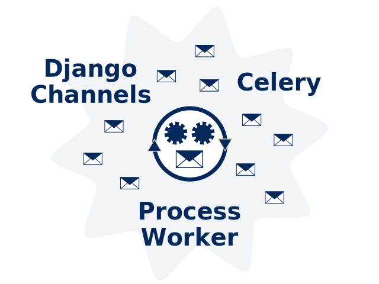

.. Django Message Broker

=====================
Django Message Broker
=====================

Introduction
============

Django Message Broker is a plugin written in Python for Django that provides an all-in-one
message broker. It interfaces with Django Channels and Celery [1], and replaces the need
for separate message brokers such as Redis and RabbitMQ.

The motivating use case for Django Message Broker is small site solutions where it is
easier to deploy a single server containing all the required functionality rather than a
multi-server solution. An example would be a small site running data science models, where
executing the model is a long running process and needs to execute in the background so
that it doesn’t degrade the responsiveness of the user interface.

Potential scenarios for Django Message Broker include:

* Prototyping, Testing, Training
* Data science projects where the model complexity exceeds the capabilities of packages such
  as Shiny, Dash and Streamlit.
* Small systems with a low number of users.

The Django Message Broker is an installable component of the Django platform that provides
an easy to install, all-in-one alternative for small scale solutions. It does not replace
the need for high volume message brokers where message volume and redundancy are important.

.. note:: 1. The Celery interface is in development and not supported in this release.

.. toctree::
   :maxdepth: 3
   :caption: Contents:
   :hidden:

   pages/installation
   pages/reference
   pages/upgrade-changelog